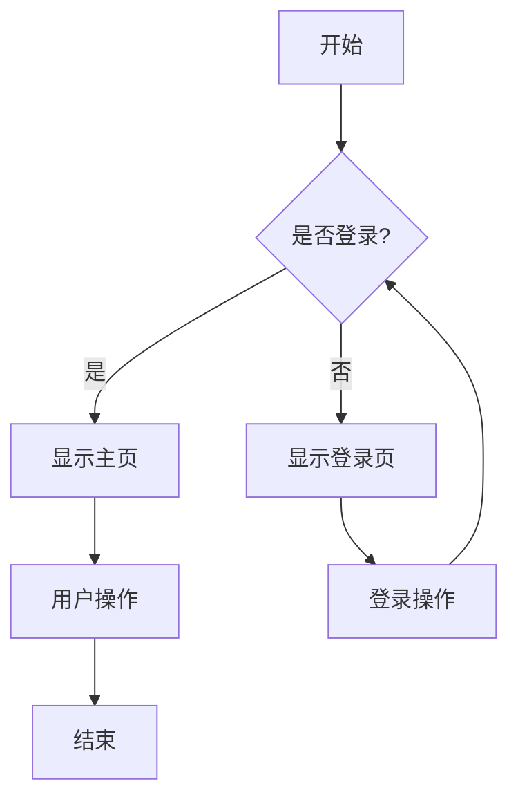
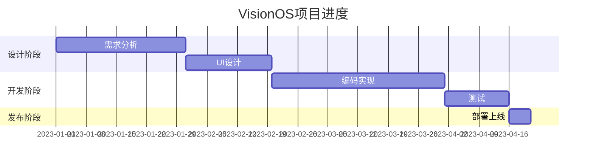

# Markdown 全功能展示

这是一个展示Markdown所有功能的示例文档，采用VisionOS设计风格进行渲染。

## 1. 文本格式化

*这是斜体文本* 或 _这也是斜体文本_

**这是粗体文本** 或 __这也是粗体文本__

***这是粗斜体文本*** 或 ___这也是粗斜体文本___

~~这是删除线文本~~

<u>这是下划线文本</u>

## 2. 标题

上面已经展示了一级和二级标题，以下是其他级别的标题：

### 3级标题
#### 4级标题
##### 5级标题
###### 6级标题

## 3. 列表

### 无序列表

* 项目1
* 项目2
  * 子项目2.1
  * 子项目2.2
* 项目3

### 有序列表

1. 第一步
2. 第二步
3. 第三步
   1. 子步骤3.1
   2. 子步骤3.2

### 任务列表

- [x] 已完成任务
- [ ] 未完成任务
- [x] 另一个已完成任务

## 4. 引用

> 这是一段引用文本。
>
> 这是引用的第二段。
>
> > 这是嵌套引用。

## 5. 代码

### 内联代码

这是一个 `内联代码示例` 展示。

### 代码块

```javascript
// 这是JavaScript代码
function greeting(name) {
  console.log(`Hello, ${name}!`);
  return `Hello, ${name}!`;
}

const result = greeting('VisionOS');
```

```python
# 这是Python代码
def factorial(n):
    if n == 0 or n == 1:
        return 1
    else:
        return n * factorial(n-1)

print(factorial(5))  # 输出: 120
```

```css
/* 这是CSS代码 */
.visionos-style {
  backdrop-filter: blur(20px);
  border-radius: 16px;
  background: rgba(255, 255, 255, 0.8);
  padding: 20px;
  color: #333;
}
```

## 6. 表格

| 名称    | 描述            | 版本   |
|---------|----------------|--------|
| VisionOS| Apple空间操作系统 | 1.0   |
| iOS     | 移动操作系统     | 16.0   |
| macOS   | 桌面操作系统     | 13.0   |

## 7. 链接

[Apple官网](https://www.apple.com)

[GitHub](https://github.com)

## 8. 图片


## 9. 水平线

---

## 10. 数学公式

行内公式：$E = mc^2$

行间公式：

$$
\frac{d}{dx}(e^x) = e^x
$$

$$
\int_0^{\pi} \sin(x) \, dx = 2
$$

## 11. 流程图

### 流程图示例 (Mermaid)



### 序列图示例

```mermaid
sequenceDiagram
    参与者 A as 用户
    参与者 B as 系统
    A->>B: 请求页面
    B-->>A: 返回页面
    A->>B: 提交表单
    B-->>A: 确认收到
```

### 甘特图示例



## 12. 脚注

这里有一个脚注[^1]。

[^1]: 这是脚注的内容。

## 13. 定义列表

Apple
: 一家设计并生产消费电子产品、计算机软件和在线服务的跨国公司

VisionOS
: Apple推出的空间计算操作系统，专为混合现实体验设计

## 14. 警告/提示框

> [!NOTE]
> 这是一个普通提示。

> [!TIP]
> 这是一个提示信息。

> [!IMPORTANT]
> 这是一个重要信息。

> [!WARNING]
> 这是一个警告信息。

> [!CAUTION]
> 这是一个需要注意的信息。

## 15. 折叠块

<details>
<summary>点击展开更多信息</summary>

这里是折叠起来的内容，可以包含各种Markdown元素。

- 列表项1
- 列表项2

</details>

## 16. 彩色文本

<span style="color:red">红色文本</span>
<span style="color:blue">蓝色文本</span>
<span style="color:green">绿色文本</span>

## 17. 上标和下标

H<sub>2</sub>O 是水的化学式

E = mc<sup>2</sup> 是爱因斯坦的质能方程

## 18. 键盘按键

使用 <kbd>Cmd</kbd>+<kbd>Shift</kbd>+<kbd>P</kbd> 打开命令面板

## 19. 网址自动链接

自动链接示例: https://www.apple.com/visionos/

## 20. 表情符号

支持表情符号 :smile: :rocket: :apple: :+1:
